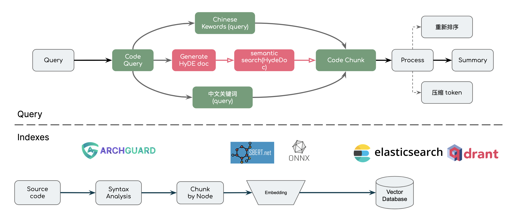
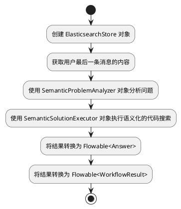

# Chocolate Factory Example

处理流程：



需要了解的基本知识：

- 基本的 Kotlin 语法
- 如何写好 Prompt 
- 检索增强（Retrieval Augmented Generation）相关的概念，可参考：RAG: [https://framework.unitmesh.cc/docs/rag](https://framework.unitmesh.cc/docs/rag)

本项目相关的 Chocolate Factory 文档:

- RAG: [https://framework.unitmesh.cc/docs/rag](https://framework.unitmesh.cc/docs/rag)
- 代码拆分：https://framework.unitmesh.cc/docs/code-splitter

## 相关论文

- [Query2doc: Query Expansion with Large Language Models](https://arxiv.org/abs/2303.07678)
- [Precise Zero-Shot Dense Retrieval without Relevance Labels](https://arxiv.org/abs/2212.10496)
- [Lost in the Middle: How Language Models Use Long Contexts](https://arxiv.org/abs/2307.03172)

## 查询过程

用户的查询条件：Semantic Workflow 是如何实现的？

生成的中间 DSL：

- question: Semantic Workflow 是如何实现的？
- englishQuery: How is Semantic Workflow implemented?
- originLanguageQuery: Semantic Workflow 是如何实现的？
- hypotheticalCode:
```kotlin
public class SemanticWorkflow {
   private WorkflowEngine engine;
   
   public SemanticWorkflow() {
      engine = new WorkflowEngine();
   }
   
   public void executeWorkflow(Workflow workflow) {
      // Perform semantic analysis on the workflow
      SemanticAnalyzer analyzer = new SemanticAnalyzer();
      Workflow analyzedWorkflow = analyzer.analyze(workflow);
      
      // Execute the analyzed workflow using the workflow engine
      engine.execute(analyzedWorkflow);
   }
}
```

相关代码片段：

```bash
0.7847863 // canonicalName: cc.unitmesh.cf.domains.semantic.CodeSemanticWorkflowTest
0.76635444 // canonicalName: cc.unitmesh.cf.domains.semantic.CodeSemanticDecl
0.74648994 // canonicalName: cc.unitmesh.cf.core.flow.ProblemAnalyzer
0.7410852 // canonicalName: cc.unitmesh.cf.domains.spec.SpecDomainDecl
0.72767156 // canonicalName: cc.unitmesh.cf.core.flow.DomainDeclaration
0.73245597 // canonicalName: cc.unitmesh.cf.core.flow.model.WorkflowResult
0.7434818 // canonicalName: cc.unitmesh.cf.domains.interpreter.CodeInterpreterWorkflow.execute
0.757218 // canonicalName: cc.unitmesh.cf.core.flow.Workflow
0.7722022 // canonicalName: cc.unitmesh.cf.domains.semantic.flow.SemanticProblemAnalyzer
0.807935 // canonicalName: cc.unitmesh.cf.domains.semantic.CodeSemanticWorkflow.execute
```

## 最后输出

根据提供的代码，我们可以看到 CodeSemanticWorkflow 是一个继承自 Workflow 的类，它实现了 execute 方法来执行语义化的代码搜索。

在 execute 方法中，它首先创建了一个 ElasticsearchStore 对象，并获取了用户最后一条消息的内容作为问题。然后，它使用 SemanticProblemAnalyzer
对象来分析问题，该对象使用 llmProvider 来完成问题的解析。接下来，它使用 SemanticSolutionExecutor 对象来执行语义化的代码搜索，并将结果转换为
Flowable<Answer>。最后，它调用 toFlowableResult 方法将结果转换为 Flowable<WorkflowResult> 并返回。

下面是一个使用 PlantUML 绘制的流程图，展示了 CodeSemanticWorkflow 的执行过程：



希望以上信息能够回答您的问题。

## 文档

环境准备：

1. Install [Elasticsearch](https://www.elastic.co/guide/en/elasticsearch/reference/current/install-elasticsearch.html)
2. Start project: `./gradlew bootRun`

### 创建索引

1. 下载 [ArchGuard Scanner CLI](https://github.com/archguard/archguard/releases) （搜索  scanner_cli-2.0.7-all.jar）
2. 运行索引

```
java -jar scanner_cli-2.0.6-all.jar --language=Kotlin --output=http --server-url=http://localhost:18080 --
path=/Volumes/source/ai/chocolate-factory --with-function-code
```

## 调试示例

执行：[API-Request.http](./API-Request.http)

结果示例：


```debug
查询条件：

question: Kotlin 代码是如何分析和处理的？
englishQuery: analyze and process Kotlin code
originLanguageQuery: // Kotlin 代码分析和处理的方法
hypotheticalCode:
val code = """
    fun calculateSum(a: Int, b: Int): Int {
        return a + b
    }
"""

val tree = KotlinParser().parse(code)
val analyzer = KotlinAnalyzer()
val result = analyzer.analyze(tree)
val processedCode = KotlinProcessor().process(result)

代码片段：

0.788222 // canonicalName: cc.unitmesh.code.interpreter.KotlinInterpreterTest
0.77546304 // canonicalName: org.archguard.scanner.analyser.count.LanguageWorkerTest.bomSkip.bomSkip2.checkComplexity.checkComplexity2.processByFileFromResource.processKotlinDemo.languageServiceFile
0.76314676 // canonicalName: org.archguard.scanner.analyser.ScalaAnalyser
0.75397754 // canonicalName: com.thoughtworks.archguard.insights.application.IssueInsightFilterTest
0.74462515 // canonicalName: org.archguard.scanner.analyser.SimpleEstimateContext
0.74160945 // canonicalName: com.thoughtworks.archguard.scanner2.domain.model.MethodMetric
0.74107826 // canonicalName: com.thoughtworks.archguard.code.module.domain.AbstractAnalysisServiceTest.setUp.should_calculate_package_abstract_ratio
0.74130785 // canonicalName: org.archguard.scanner.analyser.diffchanges.GitDiffer.countBetween.calculateChange
0.741813 // canonicalName: org.archguard.doc.generator.KotlinAnalysisTest
0.7492634 // canonicalName: org.archguard.scanner.analyser.JavaAnalyser.analyse.analysisBasicInfoByFile
0.7600594 // canonicalName: cc.unitmesh.code.interpreter.KotlinInterpreter.eval
0.7631941 // canonicalName: org.archguard.aaac.repl.ArchdocInterpreter
0.77764046 // canonicalName: org.archguard.scanner.analyser.KotlinAnalyser

```
根据提供的代码，可以看出Kotlin代码的分析和处理是通过使用不同的类和方法来完成的。以下是关键的类和方法：

1. `KotlinAnalyser`类：这个类是用来分析Kotlin代码的。它实现了`LanguageSourceCodeAnalyser`接口，并且有一个`analyse()`方法来执行代码分析。在`analyse()`方法中，它使用`getFilesByPath()`方法获取指定路径下的所有Kotlin文件，并对每个文件调用`analysisByFile()`方法进行分析。最后，它将分析结果保存到`client`中。

2. `analysisByFile()`方法：这个方法用于分析单个Kotlin文件。它首先读取文件内容，然后使用`kotlinast.KotlinAnalyser`类的`analysis()`方法对代码进行分析。分析结果包括数据结构和函数列表。最后，它将分析结果返回。

3. `KotlinReplWrapper`类：这个类是用来执行Kotlin代码的。它有一个`eval()`方法，可以执行传入的Kotlin代码，并返回执行结果。

综上所述，Kotlin代码的分析和处理是通过使用`KotlinAnalyser`类和`KotlinReplWrapper`类来完成的。`KotlinAnalyser`类用于分析代码并保存分析结果，而`KotlinReplWrapper`类用于执行代码并返回执行结果。

